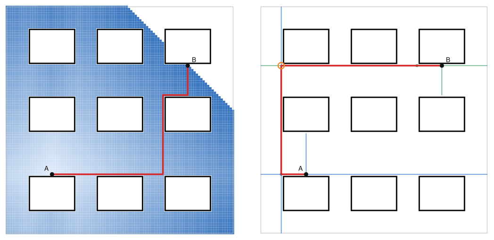
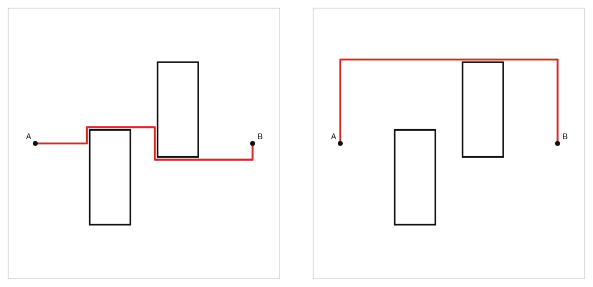
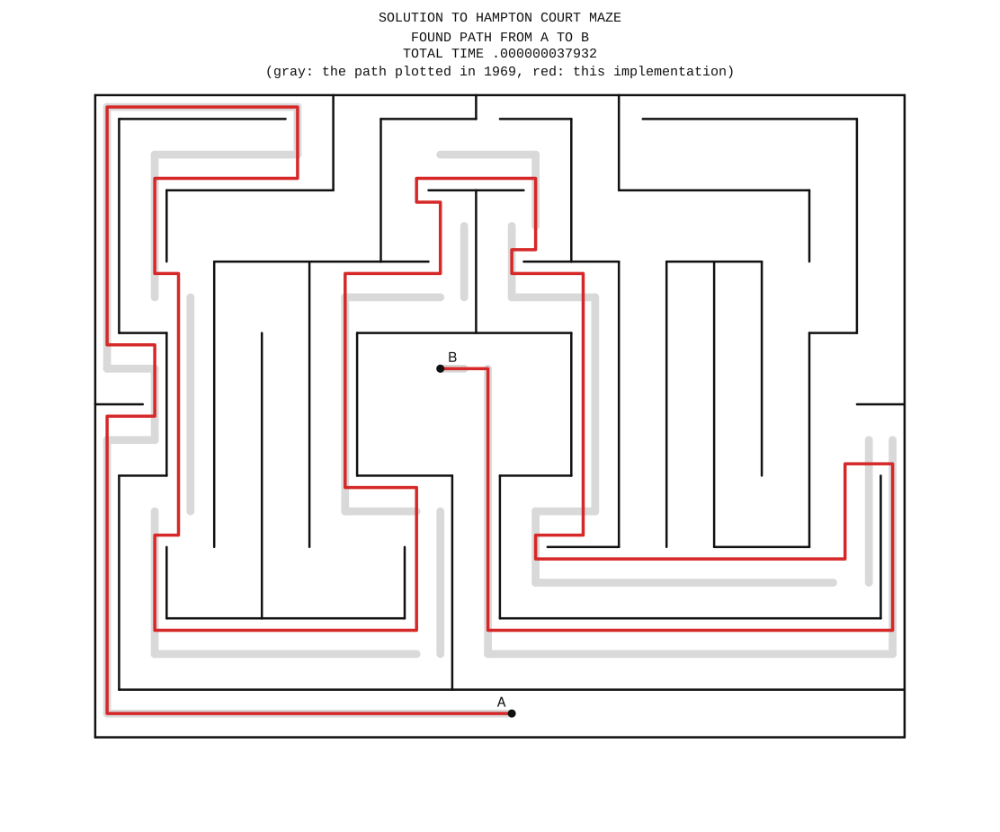
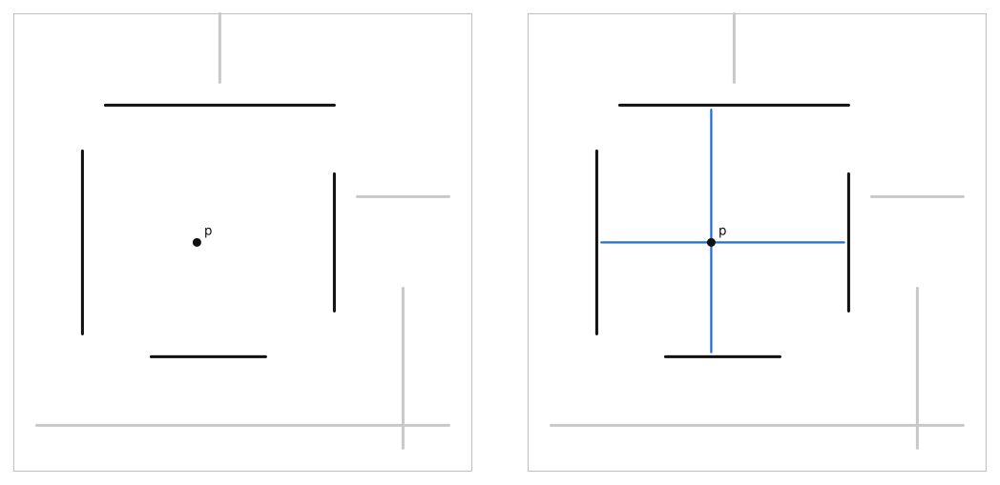
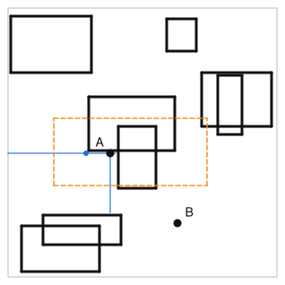
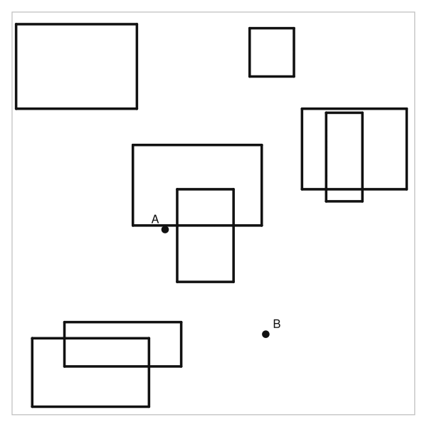
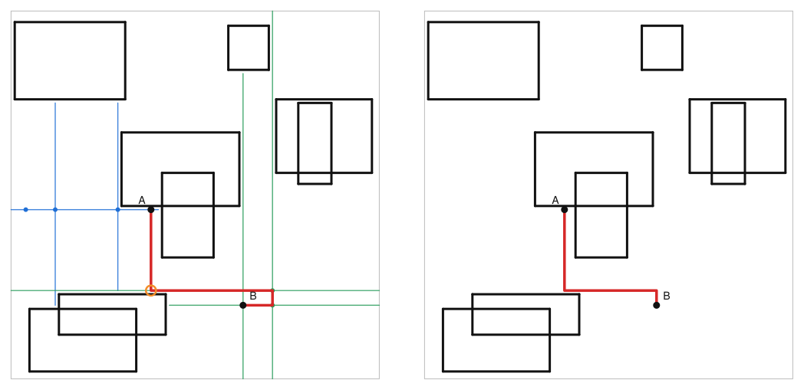
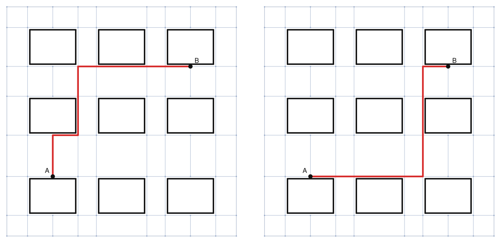

# Routing wie 1969: Hightowers Line-Search-Algorithmus in Rust

*Alle Abbildungen in diesem Artikel sind Ausgaben der beschriebenen Implementierung. Der SVG-Renderer zeichnet nach, was der Algorithmus protokolliert hat.*

Wer einen Diagramm-Editor baut, stößt irgendwann auf ein unscheinbares Problem: Zwei Kästen sollen mit einer rechtwinkligen Linie verbunden werden, und die Linie soll den anderen Kästen ausweichen. Die Aufgabe hat drei Anforderungen, die sich nicht gut vertragen. Der Editor ist interaktiv, also muss die Berechnung schnell sein, im Idealfall so schnell, dass sie beim Verschieben eines Kastens in jedem Frame mitläuft. Die Linie soll ruhig aussehen, also mit wenigen Knicken. Und ob sie die kürzeste ist, interessiert niemanden, solange sie nicht absurd aussieht.

Der Algorithmus, der zu diesem Anforderungsprofil passt, wurde 1969 bei den Bell Labs veröffentlicht, in FORTRAN II für eine IBM 7094 geschrieben und war für das Verlegen von Leiterbahnen auf Platinen gedacht. David W. Hightower nannte ihn *A Solution to Line-Routing Problems on the Continuous Plane* ([DOI 10.1145/800260.809014](https://doi.org/10.1145/800260.809014)). Ich habe ihn in Rust nachgebaut, und dieser Artikel erklärt, wie er funktioniert, wo er versagt und warum er trotzdem gut zu Diagrammen passt.



*Dasselbe Problem, zweimal gelöst. Links besucht die Breitensuche 6361 Gitterzellen, rechts konstruiert Hightowers Algorithmus fünf Linien.*

## Das Problem, und warum „kürzest" das falsche Ziel ist

Formal gesehen sind gegeben ein rechteckiges Spielfeld, eine Menge horizontaler und vertikaler Strecken als Hindernisse (ein Rechteck sind einfach vier Strecken) und zwei Punkte A und B. Gesucht ist ein Pfad aus achsenparallelen Segmenten von A nach B, der kein Hindernis berührt.

Der Klassiker dafür ist der Algorithmus von C. Y. Lee aus dem Jahr 1961. Man legt ein Gitter über das Spielfeld, markiert die Zellen unter den Hindernissen als belegt und lässt von A aus eine Breitensuche laufen, bis sie B erreicht. Das ist vollständig, findet garantiert den kürzesten Weg und ist in zehn Zeilen implementiert. Der Haken ist die Auflösung. Hightower rechnet in seinem Paper vor, was passiert, wenn man eine 9 × 9 Zoll große Platine mit einer Genauigkeit von einem Tausendstel Zoll rastern will, nämlich 81 Millionen Zellen, die man 1969 weder speichern noch durchsuchen konnte. Und selbst heute, wo der Speicher kein Problem mehr ist, wachsen Aufwand und Speicher mit der *Fläche* statt mit der Anzahl der Hindernisse. Ein fast leeres, großes Diagramm ist für die Breitensuche genauso teuer wie ein vollgestopftes.

Der zweite Punkt ist die Optimalität. Für Leiterbahnen wollte Hightower nicht den kürzesten Weg, und für Diagramme will ich ihn auch nicht. Ein kürzester Weg auf dem Gitter zwängt sich gern durch die Lücke zwischen zwei Kästen, wenn das ein paar Einheiten spart, und produziert dabei eine Treppe. Ein etwas längerer Weg mit zwei Knicken sieht in einem Diagramm besser aus, und niemand misst nach.



*Kürzest ist nicht hübsch. Links der Gitterpfad mit fünf Knicken und Länge 104, rechts Hightowers Pfad mit zwei Knicken und Länge 142.*

## Ein Zwischenspiel: Line Search gegen Flood Fill

In der Literatur zum Platinen-Routing heißt Lees Verfahren *maze routing*. Man kann sich den Flood Fill wirklich wie Wasser vorstellen, das sich von A aus durch ein Labyrinth ausbreitet. Die Alternative, die Ende der Sechziger aufkam, heißt *line probing* oder *line search*. Statt Zellen zu fluten, schießt man Linien durch den Raum und schaut, wo sie hängen bleiben. Hightowers Algorithmus ist einer der beiden Klassiker dieser Familie, der andere ist der von Mikami und Tabuchi aus dem Jahr 1968, der vollständig ist, dafür aber mehr Linien braucht. Was aus der Idee später geworden ist, kommt am Ende des Artikels.

Das Paper ist auch als Zeitdokument lesenswert. Hightower hat sein Programm auf Platinen losgelassen, auf PERT-Diagramme und auf Labyrinthe, darunter eine rechtwinklige Fassung des Heckenlabyrinths von Hampton Court. Die Plots im Anhang stammen von einem *Dataplotter* der Electronics Associated Inc., und unter dem Hampton-Court-Bild steht „Total time .0005" (die Einheit steht nicht dabei, vermutlich Stunden, was zu den Abrechnungsgewohnheiten der Zeit passen würde). Dieses Labyrinth wollte ich exakt nachbauen. Der Scan des Papers liegt mit 300 dpi vor, die dünnen Linien sind die Wände, die dicke Linie ist Hightowers gefundener Pfad. Ein kurzes Python-Skript trennt die beiden nach Strichstärke, ordnet jedes Tintenpixel einem waagerechten oder senkrechten Strich zu, schließt die Lücken an den Kreuzungen und skaliert das Ergebnis auf ganze Zahlen (vier Pixel sind eine Einheit). Heraus kommen 54 Wandstücke, dazu die Lage von A und B, abgelesen an den freien Enden der dicken Linie. Für die Zeichnung habe ich die Wände anschließend auf ein Gitter gesetzt: Die Reihenfolge der Wandkoordinaten bleibt, aber die Abstände werden auf zwei, vier oder sechs Einheiten gerundet. Für die Frage, welche Gänge wohin führen, zählt nur die Reihenfolge, das Labyrinth behält also seine Topologie, aber der Pfad hat in der Zeichnung Luft zu den Wänden. Das Feld misst dann 68 × 54 Einheiten.



*Das aus dem Scan nachgezeichnete Labyrinth mit dem Pfad dieser Implementierung. Er nimmt bis auf Kleinigkeiten dieselbe Route wie Hightowers Plot und ist hier sogar der kürzeste. Die Zeit steht in seiner Einheit: rund 0,00000004 Stunden, also etwas über eine Zehntelmillisekunde, für 49 Schritte mit 75 eingetragenen und 146 versuchten Linien.*

Dass der Router das Labyrinth überhaupt löst, war weniger selbstverständlich, als ich dachte. Dazu weiter unten mehr.

## Cover und Escape-Linien

Hightower braucht nur zwei Begriffe, und beide sind anschaulich. Für einen Punkt p nennt er das nächste Hindernis, das p in einer der vier Richtungen den Weg versperrt, ein *Cover*. Eine horizontale Strecke *covert* p, wenn das Lot von p auf die Strecke sie trifft, also wenn p in x-Richtung innerhalb der Strecke liegt. Von allen horizontalen Strecken, die p covern, ist die nächste oberhalb die Decke von p und die nächste unterhalb der Boden. Mit den vertikalen Strecken genauso, das gibt die linke und die rechte Wand.

Die *Escape-Linie* durch p ist dann die längste waagerechte (oder senkrechte) Strecke durch p, die zwischen den Covern Platz hat. Sie ist alles, was p in dieser Richtung „sieht". In der Implementierung endet sie eine Einheit vor dem Cover, damit der Pfad später automatisch Abstand zu den Hindernissen hält. Wenn in einer Richtung kein Cover existiert, endet die Linie am Rand des Spielfelds.

Ab hier benutzen alle Abbildungen dieselbe Szene: acht Kästen in einem Feld von 100 × 100 Einheiten, A am unteren Rand eines Kastens in der Mitte, B rechts unten. Wo ein Ausschnitt mehr zeigt als das ganze Bild, ist er vergrößert, und ein Sonderfall bekommt eine eigene kleine Szene.



*Links die vier Cover eines Punktes p in der Beispielszene, rechts seine beiden Escape-Linien.*

Das Schöne an dieser Definition ist, dass man sie ohne Gitter ausrechnen kann. Ich halte die horizontalen Hindernisse in einer `BTreeMap`, deren Schlüssel die y-Koordinate ist, und die vertikalen in einer zweiten mit der x-Koordinate als Schlüssel. Die Decke eines Punktes findet man, indem man in der ersten Map bei der y-Koordinate des Punktes einsteigt (das ist eine Bisektion, die `BTreeMap` erledigt sie in logarithmischer Zeit) und von dort aus Zeile für Zeile nach oben läuft, bis eine Strecke in der Zeile die x-Koordinate des Punktes überdeckt. Boden und Wände genauso, nur in die anderen Richtungen. Die Kosten hängen damit von der Anzahl der Hindernisse ab und von sonst nichts, insbesondere nicht von der Größe des Spielfelds.

## Escape-Punkte: um Ecken schleichen

Die Escape-Linien eines Punktes sind eine Sackgasse, wenn B nicht zufällig auf einer von ihnen liegt. Der Algorithmus muss also um Ecken kommen, und dafür hat Hightower zwei Prozesse.

**Prozess I** ist der Normalfall. Nehmen wir an, die Decke über dem aktuellen Punkt Z blockiert den Weg nach oben. Wenn die horizontale Escape-Linie von Z über das Ende dieser Decke hinausreicht, gehen wir seitlich bis eine Einheit hinter das Deckenende. Von dort aus kommt eine neue vertikale Escape-Linie an der Decke vorbei nach oben. Der Punkt hinter dem Deckenende ist ein *Escape-Punkt*, die neue Linie wandert ins Netz. Das Gleiche probiert der Algorithmus mit dem Boden und mit den beiden Wänden, in der Reihenfolge der euklidischen Nähe der Cover-Enden zu Z.


*Prozess I im ersten Schritt des Netzes von A. A liegt direkt unter einem Kasten, dessen Unterkante ist seine Decke (orange). Der Kandidat e liegt eine Einheit hinter dem linken Ende der Unterkante auf der horizontalen Escape-Linie von A, und die neue Linie durch e kommt am Kasten vorbei.*



*Wo der Ausschnitt in der Szene liegt.*

**Prozess II** greift, wenn kein Cover-Ende erreichbar ist, etwa weil Z in einer Tasche sitzt. Dann wandert der Algorithmus von den Enden der eigenen Escape-Linien aus Einheit für Einheit zurück in Richtung Z. An jeder Position zieht er eine senkrechte Sondenlinie, prüft, ob sie das andere Netz kreuzt, und versucht von dort aus Prozess I. Man kann sich das als Rückzug entlang der Wand vorstellen, bei dem man immer wieder über die Schulter schaut, ob sich eine Lücke auftut. Ein Detail hat mich einen Tag gekostet: Die Sondenlinien sind Versuche. Nur wenn eine Position zum Escape-Punkt wird, bleibt etwas davon im Netz zurück, alle anderen Sondenlinien werden vergessen. Im Text steht das nur indirekt, „enter the line in L" heißt es allein für die Linie durch den Objektpunkt, für die Sondenlinien nur „construct". Meine erste Fassung hatte jede Sondenlinie behalten, und damit galt sie als benutzt. Das vergiftet die Suche, weil ein späterer Prozess-I-Kandidat eben diese Linie brauchen könnte, und mit dieser Fassung blieb der Router im Hampton-Court-Labyrinth in der ersten langen Sackgasse stecken. Mit vergessenen Sondenlinien löst er es.

Für Prozess II braucht es eine besondere Situation, deshalb eine eigene Szene: Z sitzt in einer Tasche, deren Deckel eine Lücke hat, aber ein kleines Regal direkt unter der Lücke versperrt den direkten Weg dorthin.


*Prozess II. Das Regal unter der Lücke blockiert Prozess I direkt von Z aus. Der Rückzug nach oben entlang der eigenen Linie findet eine Position, von der es seitlich und dann durch die Lücke weitergeht.*

Beide Prozesse folgen einer Regel, die den Algorithmus terminieren lässt und ihn gleichzeitig unvollständig macht. Eine Escape-Linie wird nie zweimal benutzt. Jedes Netz merkt sich alle Linien, die es je gezeichnet hat, und ein Kandidat, dessen Linie schon existiert, wird verworfen. Weil es nur endlich viele verschiedene Escape-Linien gibt (jede ist ein maximales freies Intervall in einer Zeile oder Spalte), geht dem Algorithmus irgendwann der Nachschub aus, und er gibt auf. Was das für die Vollständigkeit heißt, kommt weiter unten.

## Zwei Netze wachsen aufeinander zu

Der Algorithmus arbeitet bidirektional. Ein Netz wächst von A aus, das andere von B, und sie kommen abwechselnd an die Reihe. Ein Zug besteht darin, die Escape-Linie durch den aktuellen Punkt zu zeichnen, sie gegen alle senkrecht dazu stehenden Linien des anderen Netzes zu testen und dann den nächsten Escape-Punkt zu suchen. Sobald eine Linie des einen Netzes eine Linie des anderen kreuzt, gibt es einen Pfad. Er läuft vom Kreuzungspunkt entlang der einen Linie zu ihrem Escape-Punkt, von dort zu dessen Vorgänger, und so weiter bis A, und auf der anderen Seite genauso bis B.

Das ist die ganze Rekonstruktion. Jeder Escape-Punkt liegt auf einer Escape-Linie seines Vorgängers, teilt sich mit ihm also eine x- oder y-Koordinate. Wenn man die Kette aufschreibt, ist sie automatisch rechtwinklig. In meiner Implementierung sind die Escape-Punkte ein Baum mit Elternzeigern, was den ersten Aufräumschritt aus dem Paper überflüssig macht (Hightower hatte flache Listen und musste erst herausfinden, welche Punkte zwischen welchen liegen).



*Der vollständige Lauf in der Beispielszene, Ereignis für Ereignis: sechs Züge, acht Linien. Blau ist das Netz von A, grün das von B, der orange Kreis die Kreuzung.*

Der triviale Fall funktioniert dabei von selbst. Im ersten Zug zeichnet jedes Netz beide Escape-Linien durch seinen Startpunkt. Wenn A und B sich in einer freien Zeile oder Spalte sehen, kreuzt schon die vertikale Linie von B die horizontale von A, und der Pfad hat einen Knick oder gar keinen.

## Nachbearbeitung

Der Pfad, den man aus den Bäumen abliest, ist gültig, aber nicht immer schön. Escape-Linien sind maximal lang, und ein Kreuzungspunkt liegt gern weiter außen als nötig, sodass der Pfad einen Umweg macht und wieder zurückkommt. In der Beispielszene ist es der kleine Haken rechts von B: Die Linie von A trifft die horizontale Linie von B ein Stück rechts von B, und der Pfad läuft an B vorbei, biegt ab und kommt zurück. Hightower nennt die Reparatur *second improvement*, sie läuft zweimal, einmal von A nach B und einmal über die umgekehrte Liste. Zuerst wird das erste Segment so weit verlängert, wie die Hindernisse es zulassen; trifft die Verlängerung ein späteres, senkrechtes Pfadsegment, fällt alles dazwischen weg. Dann schiebt man über jedes Segment einen Tastpunkt, vom Anfang des Segments aus Einheit für Einheit, und schießt von dort senkrechte Linien ab. Trifft eine davon ein späteres paralleles Segment, wird der Pfad dort abgekürzt, und das nächste Segment ist an der Reihe. Der erste Tastpunkt ist der Segmentanfang selbst, seine Linie ist die Verlängerung des vorherigen Segments, sodass jedes Segment verlängert und jedes abgetastet wird. Das Tasten entfernt Haken wie den bei B, und es repariert eine Eigenart von Prozess II: Der Rückzug startet immer am fernen Ende einer Linie, sodass der Rohpfad in einem Gang gern von Wand zu Wand pendelt.



*Links der rohe Pfad aus den Escape-Punkten mit dem Umweg rechts von B, rechts derselbe Pfad nach Hightowers „second improvement".*

Nach jeder Verbesserung läuft noch ein Aufräumschritt, der kollineare Punkte zusammenfasst, und im Debug-Build prüft eine Funktion, dass der Pfad wirklich bei A beginnt, bei B endet, nur rechte Winkel hat und kein Hindernis berührt.

## Implementierung in Rust

Ein paar Entscheidungen haben sich bewährt. Alle Koordinaten sind `i64`. Es gibt keinen einzigen Float im Crate, und damit auch keine Diskussion darüber, ob zwei Linien sich „fast" schneiden. Eine Einheit ist der Mindestabstand zwischen Pfad und Hindernis, und weil die Escape-Linien eine Einheit vor ihren Covern enden, ergibt sich dieser Abstand ganz von selbst.

Der gesamte Zustand des Algorithmus besteht aus zwei Netzen, und jedes Netz ist ein `Vec` von Escape-Punkten plus ein `Vec` von Linien, ohne Gitter und ohne Matrix. Die Frage „wurde diese Linie schon benutzt?" ist ein linearer Scan über die Linien des Netzes, was bei den Dutzenden von Linien, die in typischen Szenen entstehen, schneller ist als jede HashMap.

Jeder Schritt erzeugt ein `TraceEvent` (Linie gezeichnet, Escape-Punkt gefunden, Kreuzung, Rohpfad, verbesserter Pfad). Der SVG-Renderer spielt diese Ereignisse ab, und weil er ein Präfix der Ereignisliste zeichnen kann, fallen die Frames für die Animation oben einfach als Nebenprodukt heraus. Alle Bilder in diesem Artikel sind auf diesem Weg entstanden.

Der Algorithmus selbst (Geometrie, Hindernisse, Netze, Escape-Prozesse, Pfadverbesserung) hat etwa 1400 Zeilen inklusive Unit-Tests, ohne Abhängigkeiten. Die öffentliche API ist absichtlich klein.

```rust
use hightower::{Bounds, ObstacleSet, Point, route};

let mut obstacles = ObstacleSet::new(Bounds::new(Point::new(0, 0), Point::new(100, 100)));
obstacles.add_rect(Point::new(40, 20), Point::new(60, 80));

let path = route(&obstacles, Point::new(10, 50), Point::new(90, 50));
// Some([(10,50), (10,81), (90,81), (90,50)])
```

Wer mehr wissen will, ruft `route_with` auf und bekommt neben dem Pfad den Grund für das Ende der Suche (gefunden, beide Netze aufgegeben, Schrittlimit) und den vollständigen Trace zurück. Bereits gefundene Pfade lassen sich als Hindernisse eintragen, entweder komplett oder nur ihre Ecken. Letzteres ist Hightowers Modus für PERT-Diagramme: Kreuzungen sind erlaubt, aber keine zwei Pfade dürfen übereinander laufen.

## Wo es bricht

Hightower nennt im Paper zwei Nachteile, und beide lassen sich vorführen.

Der erste ist harmlos, der Pfad ist nicht der kürzeste. Im Bild weiter oben war der gefundene Pfad 142 Einheiten lang statt 104. Für Diagramme ist das der gewünschte Kompromiss. Für Platinen schlug Hightower vor, den Algorithmus mehrfach mit leicht veränderten Regeln laufen zu lassen und den kürzesten der Kandidaten zu nehmen.

Der zweite ist ernster. Der Algorithmus kann einen Pfad übersehen, der existiert, und das liegt an der Regel, dass keine Escape-Linie zweimal benutzt wird. Hightower beschreibt den Fall selbst. Wenn das Netz eine Escape-Linie benutzt hat, um durch eine schmale Öffnung in eine Box zu gelangen, kommt es durch dieselbe Öffnung nicht wieder heraus. Er schreibt dazu, in allen seinen Experimenten sei ein Pfad gefunden worden, wenn einer existierte. Ich habe das nachgeprüft, indem ich zufällige Szenen aus Räumen mit Türen erzeugt und jede Antwort gegen die Breitensuche abgeglichen habe (die Breitensuche ist vollständig, deshalb taugt sie als Orakel). Von 16782 lösbaren Szenen hat der Algorithmus 297 nicht gelöst, also knapp 2 Prozent. Die kleinste davon hat sieben Strecken:


*Der blinde Fleck. B kommt durch die Lücke rechts aus der Box, A kommt von oben in denselben schmalen Streifen, und dort geben beide Netze auf, weil ihre Linien am Spielfeldrand enden und Hightower von Rändern aus keinen Rückzug vorsieht. Der gestrichelte Weg links herum bleibt unentdeckt.*

Der Grund für dieses Beispiel ist ein Detail in Prozess II. Hightower definiert die Rückzugspositionen als Schnittpunkte der Escape-Linie mit ihren Covern. Endet die Linie am Spielfeldrand, gibt es kein Cover und damit keinen Rückzug. Eine Variante, die sich auch von Rändern zurückzieht, findet diese Szene und drückt die Fehlerquote auf 0,2 Prozent, probiert dafür in offenen Szenen aber Hunderte Sondenlinien, weil sie an einer Linie von Rand zu Rand jede einzelne Position abklappert. Das ist wieder ein Gitter, nur durch die Hintertür. Im Crate ist sie als Option erhalten, die Voreinstellung folgt dem Paper.

Für die Praxis ist Hightower damit eine schnelle Heuristik mit einem Rückfallpfad: erst Hightower, bei `None` ein vollständiger Algorithmus, und Pfade nur dann neu berechnen, wenn sich innerhalb ihrer Bounding Box etwas geändert hat. Welcher vollständige Algorithmus das sein sollte, dazu gleich.

## Der Nachfolger: Sichtbarkeitsgraph und A*

Was hat sich seit 1969 durchgesetzt? Interessanterweise keine bessere Variante der Liniensuche, sondern eine Kombination aus Hightowers Grundidee und klassischer Graphsuche. Die Einsicht, dass nur die Kanten der Hindernisse zählen und das Gitter dazwischen Verschwendung ist, hat überlebt. Sein gieriges Wachsen zweier Netze hat es nicht.

Der Standard für Diagramm-Editoren ist heute *Orthogonal Connector Routing* von Wybrow, Marriott und Stuckey (Graph Drawing 2009), implementiert in der Bibliothek *libavoid*, die unter anderem Inkscape benutzt. Die Konstruktion ist einfach. Man nimmt die horizontalen und vertikalen Geraden durch alle Hindernisseiten, um eine Einheit nach außen verschoben, dazu die Geraden durch Start und Ziel. Ihre Schnittpunkte bilden die Knoten eines Graphen, die freien Stücke dazwischen die Kanten. Jeder rechtwinklige Pfad lässt sich auf dieses dünne Gitter schieben, ohne länger zu werden, also findet eine Suche darauf immer einen Pfad, wenn es einen gibt, und mit A* auch den kürzesten. Weil A* eine Kostenfunktion bekommt, kann man Knicke gleich mit bestrafen. Der blinde Fleck von oben ist damit weg, und die Frage „kürzest oder ruhig?" wird ein Parameter.



*Der orthogonale Sichtbarkeitsgraph der Szene vom Anfang, 80 Knoten und 136 Kanten. Links der kürzeste Pfad (drei Knicke), rechts derselbe Graph mit einer Knickstrafe von 20 Einheiten (zwei Knicke, 40 Einheiten länger).*

Ich habe diesen Router als zweite Referenz in das Crate aufgenommen (`route_visibility`). Der Graph wird dabei nie aufgebaut, A* entdeckt Knoten und Kanten unterwegs und fragt die Hindernismenge, ob ein Stück frei ist. Für Rechtecke reichen die Außenseiten, lose Strecken bekommen beide Seiten. Der Preis ist die Größe des Graphen, im schlimmsten Fall quadratisch in der Zahl der Hindernisse, und der Aufwand von A*, der bei 20 Rechtecken keine Rolle spielt und bei 320 durchaus. Für den Diagramm-Editor ist das der Rückfallpfad: erst Hightower, bei `None` der Sichtbarkeitsgraph.

## Wie schnell ist es?

Ich habe alle drei Router auf denselben Szenen mit zufällig platzierten Rechtecken laufen lassen: Hightower, den Sichtbarkeitsgraphen mit A* und die bewusst naive Breitensuche. Die Zahlen sind Mediane über 41 Szenen pro Konfiguration, gemessen auf einem gewöhnlichen Laptop.

![Zwei Liniendiagramme mit logarithmischer Zeitachse. Links wächst die Kantenlänge des Spielfelds von 64 auf 2048 bei 20 Hindernissen: die Breitensuche steigt von rund 100 Mikrosekunden auf 77 Millisekunden, der Sichtbarkeitsgraph bleibt bei 18 bis 22 Mikrosekunden, Hightower bei ein bis vier Mikrosekunden. Rechts wächst die Zahl der Rechtecke von 0 auf 320 bei fester Fläche: die Breitensuche bleibt bei einer halben bis einer Millisekunde, der Sichtbarkeitsgraph steigt von etwa einer Mikrosekunde auf über eine halbe Millisekunde, Hightower von 0,6 auf knapp 50 Mikrosekunden.](images/12_benchmark.svg)

*Links: Die Fläche wächst, die Anzahl der Hindernisse bleibt. Rechts: Die Fläche bleibt, die Hindernisse werden mehr.*

Die linke Kurve ist der Grund für diesen Artikel. Bei 20 Rechtecken braucht Hightower ein bis vier Mikrosekunden pro Route, und es ist ihm egal, ob das Spielfeld 64 oder 2048 Einheiten breit ist. Dem Sichtbarkeitsgraphen ist es ebenso egal, er liegt konstant bei etwa 20 Mikrosekunden, also rund zehnmal über Hightower. Die Breitensuche skaliert mit der Fläche und landet bei 2048 Einheiten Kantenlänge bei 77 Millisekunden, was für einen interaktiven Editor mit vielen Kanten zu langsam wäre.

Rechts sieht man, was die beiden gitterfreien Verfahren kostet. Mit der Anzahl der Hindernisse wachsen die Kosten bei Hightower, weil jede Cover-Abfrage durch mehr Zeilen läuft und Prozess II mehr Linien probiert; beim Sichtbarkeitsgraphen wächst die Knotenzahl quadratisch, und A* muss entsprechend mehr davon anfassen. Bei 160 Rechtecken auf 256 × 256 Einheiten ist die Szene so voll, dass der Sichtbarkeitsgraph länger braucht als die Breitensuche, während Hightower bei knapp 50 Mikrosekunden liegt. Ein Diagramm-Editor hätte in dieser Szene allerdings andere Sorgen. In der Spalte ganz rechts fällt außerdem auf, dass bei 160 Rechtecken 26 der Zufallsszenen von Hightower nicht gelöst wurden; die Messung zählt nur Szenen, die alle drei Router schaffen.

Für den Editor ergibt sich daraus eine einfache Arbeitsteilung: Hightower für die vielen Kanten, die er in einer Mikrosekunde erledigt, und der Sichtbarkeitsgraph für die wenigen, bei denen er passt.

## Was noch fehlt

Hightower beschreibt im Paper vier Betriebsmodi für ganze Netzlisten, von „alle Verbindungen ohne Kreuzungen" bis zur Simulation einer zweiseitigen Platine. Davon habe ich nur den Baustein umgesetzt, dass fertige Pfade zu Hindernissen werden. Die Reihenfolge der Netze (Hightower empfiehlt, mit den kurzen anzufangen) bleibt dem Aufrufer überlassen. Beim Sichtbarkeitsgraphen fehlt die Beschleunigung aus dem Nachfolgepaper *Seeing Around Corners* (Diagrams 2014), das topologisch gleichwertige Routen zusammenfasst, und das inkrementelle Neuberechnen beim Verschieben von Kästen, das libavoid kann.

Der Code liegt auf GitHub unter [REPO-URL]. Die Beispiele im Ordner `examples/` erzeugen alle Abbildungen dieses Artikels, das Labyrinth eingeschlossen, und der Benchmark schreibt eine CSV, aus der ein kurzes Python-Skript das Diagramm oben zeichnet.
